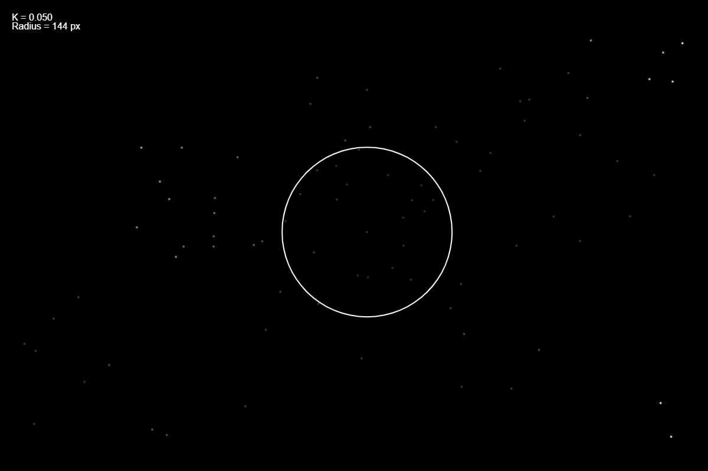

# Fireflies Synchronization (p5.js)

This project simulates the synchronization phenomenon of fireflies using p5.js. The idea and implementation are inspired by the book "Sync: How Order Emerges from Chaos in the Universe, Nature, and Daily Life" by Steven Strogatz, which explores the science of synchronization in nature and technology. Each firefly is represented as a moving dot, and their phases can synchronize based on adjustable parameters. The simulation is interactive and visually demonstrates how local interactions can lead to global synchronization.

## Features
- **Firefly Simulation:** Each firefly moves randomly and has an internal phase.
- **Synchronization Control:** Adjust the coupling constant (K) and the interaction radius using sliders.
- **Add/Select Fireflies:** Click on the canvas to add new fireflies or select existing ones.
- **Visual Feedback:** Synchronized fireflies are highlighted, and the selected firefly shows its interaction radius.
- **Enable/Disable Synchronization:** Toggle the synchronization effect with a button.

## Try It Out
You can try the simulation live at: [Fireflies Synchronization Demo](https://adebiasi.github.io/Fireflies-sync/})

## How to Use
1. **Open `index.html` in your browser.**
2. Use the sliders at the top to adjust the coupling constant (K) and the interaction radius.
3. Click on the canvas to add new fireflies or select an existing one.
4. The button allows you to enable or disable synchronization.

## Controls
- **K Slider:** Controls the strength of synchronization between fireflies.
- **Radius Slider:** Sets the distance within which fireflies interact.
- **Synchronization Button:** Enables or disables the synchronization effect.
- **Mouse Click:**
  - On canvas: Selects or adds fireflies.
  - On controls: Adjusts parameters immediately.

## Kuramoto Model
This simulation is inspired by the Kuramoto model, a mathematical framework used to describe synchronization phenomena in systems of coupled oscillators. In the context of fireflies, each firefly is modeled as an oscillator with its own phase and natural frequency. The interaction between fireflies is governed by the coupling constant (K) and the interaction radius, which determine how strongly and with whom each firefly synchronizes.

The Kuramoto model is described by the following equation:

$$
\frac{d\theta_i}{dt} = \omega_i + \frac{K}{N} \sum_{j=1}^N \sin(\theta_j - \theta_i)
$$

where:
- $\theta_i$ is the phase of oscillator (firefly) $i$,
- $\omega_i$ is its natural frequency,
- $K$ is the coupling constant,
- $N$ is the number of oscillators,
- the sum is over all other oscillators.

The Kuramoto model demonstrates how local interactions can lead to global synchronization, a phenomenon observed in nature among fireflies and other systems.

## License
This project is licensed under the MIT License.

## Credits
Developed by A.Debiasi. Inspired by the natural phenomenon of firefly synchronization and the Kuramoto model.
